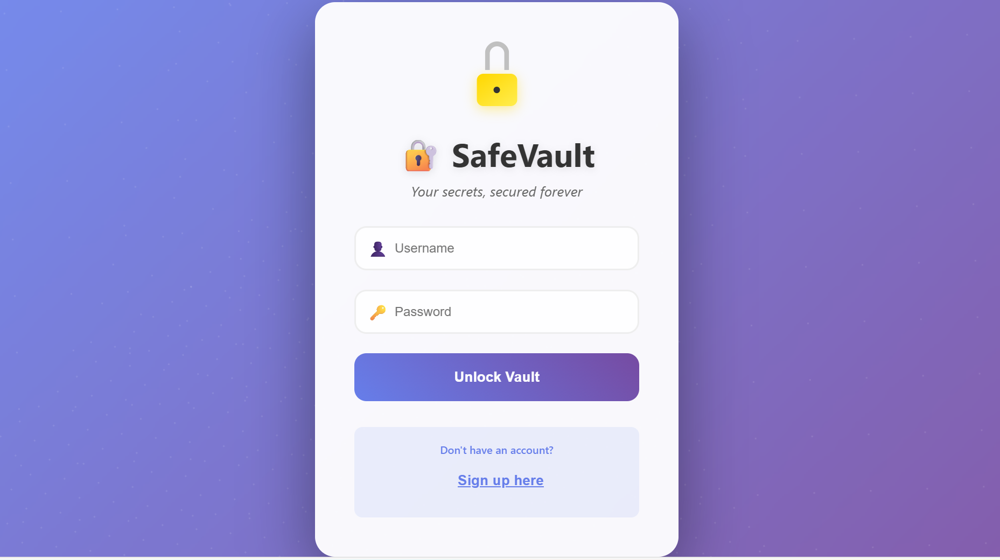

# SafeVault Lite

Secrets management application with AWS Secrets Manager integration, JWT authentication, and automated CI/CD.

## 🏗️ Architecture

```
┌─────────────────┐    ┌─────────────────┐    ┌─────────────────┐
│   React UI      │────│   FastAPI       │────│  AWS Secrets    │
│   (Frontend)    │    │   (Backend)     │    │   Manager       │
└─────────────────┘    └─────────────────┘    └─────────────────┘
         │                       │                       │
         │              ┌─────────────────┐              │
         └──────────────│   SQLite/       │──────────────┘
                        │   PostgreSQL    │
                        └─────────────────┘
```
## LOG IN PAGE


## 🔐 Features

- **JWT Authentication** - Secure token-based sessions
- **Password Hashing** - Bcrypt encryption
- **Failed Login Alerts** - Email notifications for suspicious activity
- **Audit Logging** - Complete security event trail
- **AWS Integration** - Hybrid local + cloud storage
- **Category Organization** - Group secrets by type
- **Offline Fallback** - Works without AWS connection

## 🛠️ Tech Stack

- **Backend**: FastAPI, Python 3.11, SQLAlchemy, JWT Authentication
- **Frontend**: React 18, Axios, React Router, Responsive CSS
- **Database**: SQLite (development), PostgreSQL (production)
- **Cloud**: AWS Secrets Manager, EC2 deployment
- **Monitoring**: Prometheus metrics, Grafana dashboards
- **Containerization**: Docker, Docker Compose
- **Orchestration**: Kubernetes, Kind (testing)
- **CI/CD**: GitHub Actions with automated builds and deployments

## 🚦 CI/CD

- **Smart Builds** - Only builds changed components
- **Docker Hub** - Automatic image push with SHA tags
- **GitHub Pages** - Frontend deployment
- **Kind Testing** - Kubernetes validation
- **Prometheus** - Metrics collection

## 🏃♂️ Quick Start

### Option 1: Docker Compose (Recommended)
```bash
git clone https://github.com/apurvagargote/SafeVault-Lite.git
cd SafeVault-Lite

# Create environment file
cp .env.example .env
# Edit .env with your AWS credentials

# Start all services
docker-compose up -d
```
- **Frontend**: http://localhost:3000
- **Backend API**: http://localhost:8000
- **Grafana Dashboard**: http://localhost:3001 (admin/admin)

### Option 2: Local Development
```bash
# Backend setup
cd backend
pip install -r requirements.txt
uvicorn app:app --reload --host 0.0.0.0 --port 8000

# Frontend setup (new terminal)
cd frontend
npm install
npm start
```

### Option 3: Kubernetes Deployment
```bash
# Create Kind cluster
kind create cluster --name safevault

# Deploy application
kubectl apply -f k8s/deploy-all.yaml

# Access via port-forward
kubectl port-forward service/safevault-frontend-service 3000:80
kubectl port-forward service/safevault-backend-service 8000:8000
```

## 📁 Project Structure

```
SafeVault-Lite/
├── backend/                 # FastAPI application
│   ├── app.py              # Main application with all endpoints
│   ├── auth.py             # JWT authentication & password hashing
│   ├── database.py         # SQLAlchemy models (User, Secret, SecurityLog)
│   ├── metrics.py          # Prometheus metrics collection
│   ├── Dockerfile          # Backend container configuration
│   └── requirements.txt    # Python dependencies
├── frontend/               # React application
│   ├── src/
│   │   ├── App.js         # Main component with routing
│   │   ├── Login.js       # Authentication interface
│   │   ├── Signup.js      # User registration
│   │   └── *.css          # Responsive styling
│   ├── public/
│   │   └── index.html     # HTML template
│   ├── Dockerfile         # Frontend container configuration
│   └── package.json       # Node.js dependencies
├── k8s/                   # Kubernetes manifests
│   ├── deploy-all.yaml    # Complete application deployment
│   ├── grafana-deployment.yaml    # Monitoring dashboard
│   ├── prometheus-deployment.yaml # Metrics collection
│   └── monitoring-rbac.yaml      # Monitoring permissions
├── monitoring/            # Monitoring configuration
│   ├── grafana/          # Dashboard configurations
│   └── prometheus.yml    # Metrics scraping config
├── .github/workflows/     # CI/CD automation
│   └── ci-cd.yml         # GitHub Actions pipeline
├── docker-compose.yml     # Local development environment
├── docker-compose.monitoring.yml  # Monitoring stack
└── .env.example          # Environment variables template
```

## 🔧 Configuration

### Environment Variables
Create `.env` file from template:

```bash
# Security Configuration
SECRET_KEY=your-super-secure-jwt-secret-key
DATABASE_URL=sqlite:///./safevault.db

# AWS Secrets Manager
AWS_ACCESS_KEY_ID=your-aws-access-key
AWS_SECRET_ACCESS_KEY=your-aws-secret-key
AWS_REGION=eu-west-1

# Email Alerts (Gmail SMTP)
SMTP_SERVER=smtp.gmail.com
SMTP_PORT=587
SMTP_USERNAME=your-email@gmail.com
SMTP_PASSWORD=your-gmail-app-password
FROM_EMAIL=noreply@safevault.com
```

### GitHub Secrets (for CI/CD)
Required repository secrets:

- `DOCKER_USERNAME` - Docker Hub username
- `DOCKER_PASSWORD` - Docker Hub access token


## 📊 Monitoring

- **Prometheus**: http://localhost:9090 - Metrics collection
- **Grafana**: http://localhost:3001 (admin/admin) - Dashboards
- Tracks: HTTP requests, auth events, AWS ops, business metrics

## 🚀 Production Deployment

### AWS EC2 Deployment
```bash
# On your EC2 instance
git clone https://github.com/apurvagargote/SafeVault-Lite.git
cd SafeVault-Lite

# Configure environment
cp .env.example .env
# Edit .env with production values

# Deploy with Docker Compose
docker-compose up -d

# Access application
# Frontend: http://your-ec2-ip:3000
# Backend: http://your-ec2-ip:8000
```

### Kubernetes Production
```bash
# Create AWS credentials secret
kubectl create secret generic aws-credentials \
  --from-literal=access-key-id=your-key \
  --from-literal=secret-access-key=your-secret

# Deploy application
kubectl apply -f k8s/deploy-all.yaml

# Verify deployment
kubectl get pods
kubectl get services
```

## 🔒 Security

**Implemented**: Bcrypt hashing, JWT tokens, input validation, SQL injection prevention, CORS, audit logging

**Production**: Use HTTPS, configure firewalls, enable AWS CloudTrail, regular updates

## 🤝 Contributing

1. Fork the repository
2. Create feature branch: `git checkout -b feature/amazing-feature`
3. Commit changes: `git commit -m 'Add amazing feature'`
4. Push to branch: `git push origin feature/amazing-feature`
5. Open Pull Request

### Development Guidelines
- Follow PEP 8 for Python code
- Use ESLint for JavaScript code
- Write comprehensive tests
- Update documentation for new features
- Ensure security best practices

## 📝 License

This project is licensed under the MIT License - see the [LICENSE](LICENSE) file for details.

## 🔗 Links

- **Repository**: [https://github.com/apurvagargote/SafeVault-Lite](https://github.com/apurvagargote/SafeVault-Lite)
- **Docker Hub**: [https://hub.docker.com/u/apurva1025](https://hub.docker.com/u/apurva1025)

---

**Built with ❤️ by [Apurva Gargote](https://github.com/apurvagargote)**
